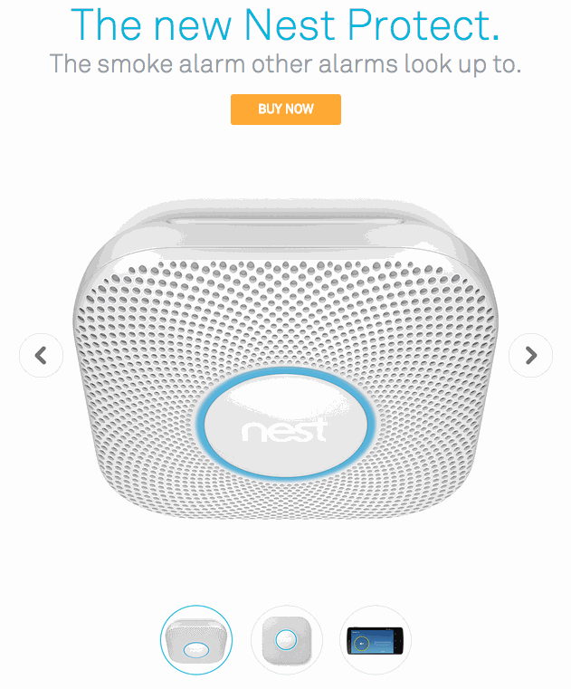
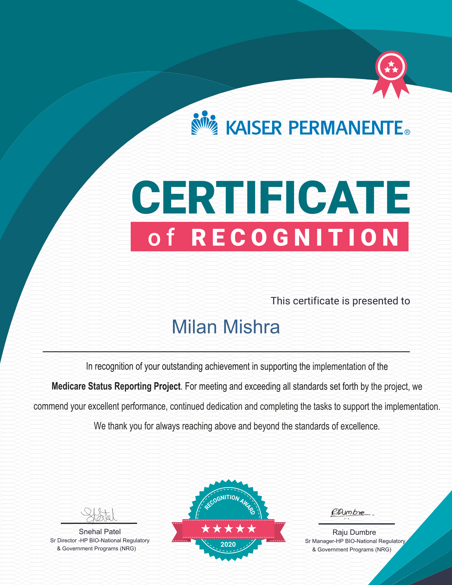
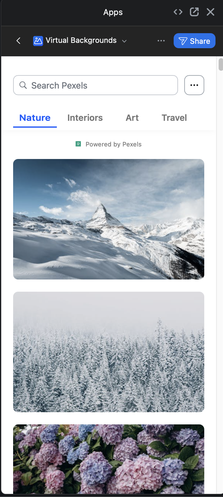
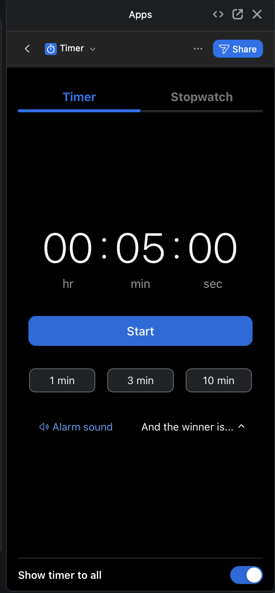
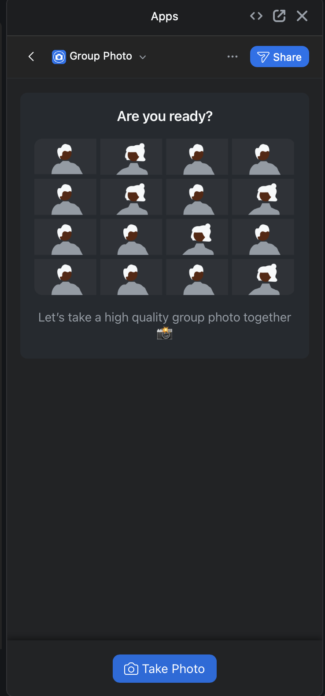

# milan-frontend-engineering

## Intro

Since the beginning of my software engineering career, I've always been more frontend-development oriented. This repo serves as a developmental arc showcase (and a highlight reel) of my frontend knowledge. So far in my career, I'm 60% front-end oriented 40% back-end oriented.

## Pre-Career Side Projects

[I developed a simple browser extension](https://github.com/milanify/Auto-eBay-Feedback) that saves time for people on eBay who want to leave positive feedback efficiently. This is a 1-click solution. Type your feedback once, and it propagates to all your transactions. Using the extension beats manually going through each transaction to leave feedback via eBay's website, which is a click-intensive flow. The extension was published on multiple browser marketplaces and has a simple, intuitive UI. I even received a random $20 donation from it, proving its utility.

[I developed simple custom styles](https://github.com/milanify/userstyles) that apply CSS styles to popular websites to remove clutter. My mindset was to simplify the UI/UX of common website homepages to make them more "Google-like." Just a simple search bar. I found the user experience to be (subjectively) better, and the lower page clutter increased my focus and attention.

[I developed a simple Python app](https://github.com/milanify/DownloadArtwork) that allows users to download pictures from Google Images with a 1-click solution. This greatly increases the speed of downloading images, which traditionally is a clunkier, click-intensive process: right-clicking the image, saving it, choosing the save location, and then clicking save.

[I developed a simple desktop app](https://github.com/milanify/ForeverNote) for Evernote since none existed at the time. Evernote themselves supported web only. My desktop app was written using JavaFX, a Java frontend framework. Also, fun fact: Java was my first programming language and is still my favorite! Another fun fact: Evernote's lawyers contacted me to shut this project down because they viewed it as "a threat," since they eventually built their own desktop client.

## Early Career Side Projects

[I developed a simple Android app](https://github.com/milanify/Android-Fast-Charging-Checker) that lets users know if their phone is fast charging using a real-life audio sound. The UI is a simple toggle — either enable the service or not. When enabled, your phone plays a preset, bundled custom sound (a double charging sound) when it's fast charging.

The reason this was necessary is that sometimes you'd plug in your phone to charge but it wasn't fast charging — even if you were using a faster charger — requiring you to re-plug it in. There was no way of knowing without manually checking the charge state. Furthermore, it's a nice-to-have when you're intentionally using a non-fast charger and want confirmation that it's charging at a slower speed.

[I developed a simple desktop app](https://github.com/milanify/Coinbase-Pro-Desktop) for trading on Coinbase. It's a rudimentary Electron.js wrapper. The project allowed me to explore different cross-platform desktop frameworks at the time (there were C++ and C# solutions as well). Ultimately, I chose a JavaScript-based solution for its simplicity.

[I developed a simple Google Workspace extension](https://github.com/milanify/Google-Docs-To-Do-List) that converts a Google Doc into a to-do list. It allows users to have a sidebar UI for creating, deleting, and managing their notes. Fun fact: I even ran customer support briefly because I had teachers using it who emailed me about bugs!

[I developed a simple Linux utility](https://github.com/milanify/Ubuntu-Launchpad) that adds a macOS "Launchpad"-style utility to your desktop as an icon.

## Early Career (80% front-end, 20% back-end)

[I worked for the Google Store team](https://store.google.com/?hl=en-US), Google's e-commerce website for their hardware products. I worked on their email team, iterating on and developing new email frontends. Fun fact: we had 200+ permutations of emails that we kept track of in a Google Sheet!

Here, I created interactive emails (see below). Our team was considered an "Email Engineering" team. It was a fun, dynamic team, and I got to work across Product, Marketing, Design, and Engineering teams to create scalable, branded UI/UX experiences.

I also proactively created scripts to increase our team's workflow and velocity, since our development was non-traditional (we weren’t developing traditional websites; instead, we had custom IDEs, unique local workflows, and niche code repository architectures to deal with). Fun fact: I was part of a key milestone at Google Store — the brand integration of Google Store and Google Nest products. Below is an example of a dynamic email we developed, which we typically favored over static ones due to higher levels of engagement.

After Google, I worked for Kaiser Permanente on React.js frontends. This was my first exposure to React since we weren’t using it at Google, and an introduction to more traditional website development. I don’t have access to the code, and most of the websites were behind an authentication layer, so I can’t showcase them. However, here is a certificate of recognition I received for one of our projects.

## Master’s Degree

While working full-time, I earned a Master’s Degree in Computer Science from the University of Illinois Urbana-Champaign. It was an amazing journey — shoutout to the school for providing me this opportunity. I completed various projects across computer science domains — including IoT, distributed systems, machine learning, statistics, and data visualization.

## Mid Career (60% front-end, 30% back-end)

Using all of my career momentum up to this point, I joined Zoom during their post-COVID growth phase. It was an exciting time! [I joined the Zoom Apps team](https://marketplace.zoom.us/), an app store ecosystem that Zoom was building from scratch. I saw it go from 0 to 1 and was part of a startup-like team. I worked on various first-party apps at Zoom, here are sample images of a few of the apps I worked on:

  
  
  

[The first app, Virtual Backgrounds,](https://marketplace.zoom.us/apps/bds99mN4S_i7ktJINgsNXw) allows a user to search for high-quality images and set them as their background. It's a simple and intuitive app for querying images. I built it with responsiveness, infinite scroll, and efficient API querying and data modeling libaries like React-Redux.

[The second app, Timer,](https://marketplace.zoom.us/apps/cXw5IXmqT6SIIBQxgM_PfQ) allows a user to set a timer or stopwatch that gets dynamically drawn onto their video screen for all participants in the meeting to see. Fun fact: Windows OS and macOS both had system-specific issues I had to debug! I also worked on implementing light mode and dark mode.

[The third app, Group Photo,](https://marketplace.zoom.us/apps/_M-iOa7hQBi0pn3aNhScGg) allows all participants in a meeting to take a picture together. This even scales to a high number of participants (1000+). The most fun part of this project was dealing with the math. I had to determine how to programmatically code an efficient grid of images that maintained a proper aspect ratio depending on the number of users. For example, with 2 participants the image is a rectangle. With 4 participants it's a square. For an odd number of participants, the rows and columns won’t have equal values.

All of these apps were developed with React.js frontends and Node.js backends. AWS was our cloud infrastructure provider. The databases we used depended on the type of app — anything from Redis to Postgres to Lambda functions to browser LocalStorage.

In addition to building 1st party apps, I also supported 3rd party developers in building their apps — anyone from individual developers to large enterprise companies such as Figma, Notion, and Meta. Furthermore, I worked on a key architectural piece that underpinned the entire platform: the [Zoom Apps JavaScript SDK](https://appssdk.zoom.us/). This is what allows the Zoom Desktop client, written in C++, to interface with all of our JavaScript web apps. I worked on adding new methods to the SDK, deprecating old methods, and publishing releases internally, to NPM, and to GitHub.

## Conclusion

I build frontend systems that make complex functionality feel simple, scalable, and intuitive.

I bring a systems-oriented mindset shaped by my background in engineering and computer science, with a strong focus on performance, usability, and maintainability. I think deeply about how software behaves across environments and how small details impact the overall user experience.

I approach frontend engineering with a human-first mindset shaped by broad exposure to different environments and perspectives, which informs how I think about usability, accessibility, and design patterns at scale. I pay close attention to responsiveness and interaction details, because those are what build trust and make products feel reliable over time. At the same time, I have a strong appreciation for aesthetics—drawing from interests in fashion, art, photography, and visual composition—which shows up in how I think about balance, clarity, and polish in UI/UX. More fundamentally, I’m interested in systems and how complexity emerges, whether in software, mathematics, or broader conceptual frameworks, and I tend to approach problems from first principles with an emphasis on simplicity and coherence. [One of my favorite Wikipedia articles is about mathematical beauty.](https://en.wikipedia.org/wiki/Mathematical_beauty)

I’m particularly interested in the evolution of interfaces alongside AI, and in building products that make powerful systems feel natural and accessible to users.
